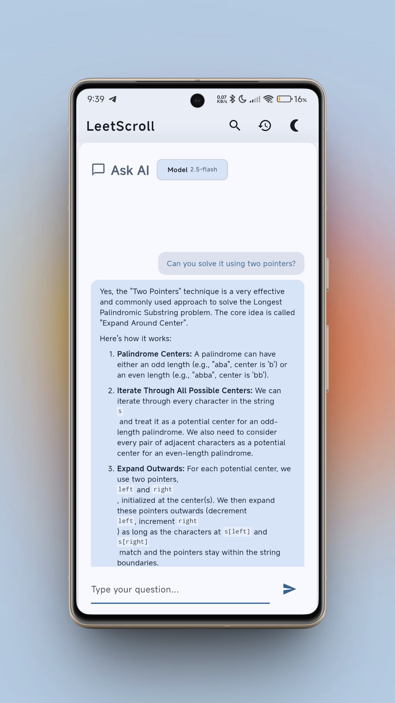

# LeetScroll


---

## Overview


LeetScroll is a fun way to practice LeetCode problems—think of it like scrolling through Reels or Shorts, but for coding! Each problem pops up as a full-screen card you can flip and swipe through. All the questions are grabbed and organized using Python and BeautifulSoup. If you ever get stuck, just flip the card and chat with Gemini for instant coding help and explanations. Built with Flutter and Dart, LeetScroll makes LeetCode review way more interactive and enjoyable.

---

## Screenshots

<p align="center">
  
  
  
  
  
</p>

---

## Getting Started

To run this project locally:

1. **Install Flutter:** [Flutter installation guide](https://docs.flutter.dev/get-started/install)
2. **Clone the repository:**
	```sh
	git clone https://github.com/neenza/leetscroll_app.git
	cd leetscroll_app
	```
3. **Install dependencies:**
	```sh
	flutter pub get
	```
4. **Run the app:**
	```sh
	flutter run
	```

---

## Resources

- [Lab: Write your first Flutter app](https://docs.flutter.dev/get-started/codelab)
- [Cookbook: Useful Flutter samples](https://docs.flutter.dev/cookbook)
- [Flutter Documentation](https://docs.flutter.dev/)

---
